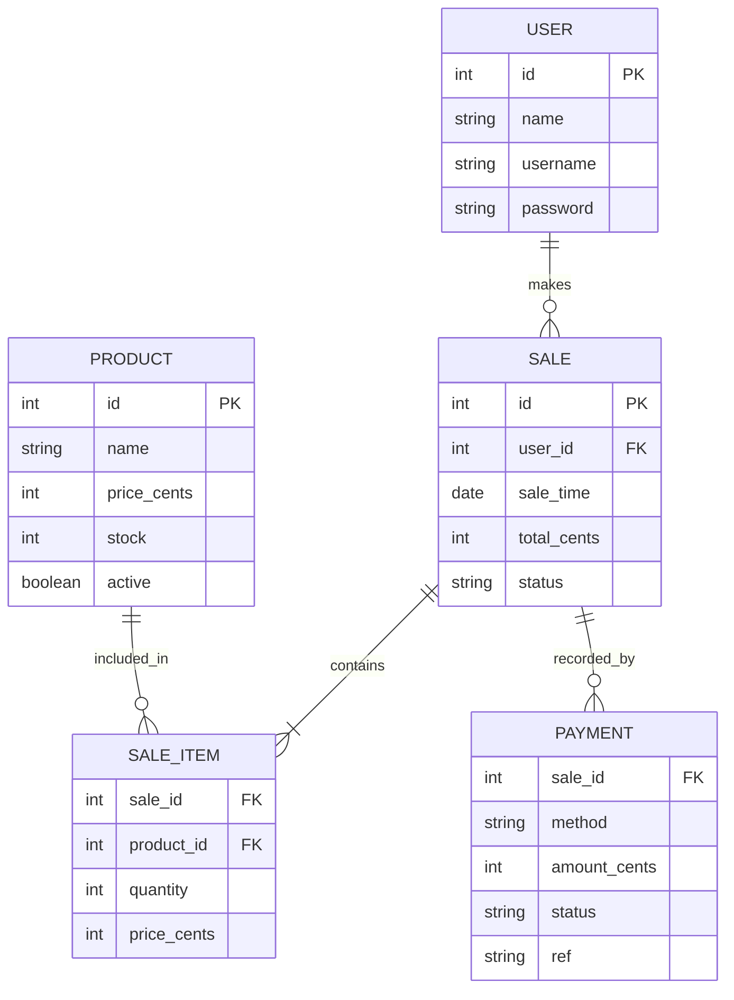

# Database Schema (UML-ish)

```mermaid
erDiagram
  USER ||--o{ SALE : makes
  SALE ||--|{ SALE_ITEM : contains
  PRODUCT ||--o{ SALE_ITEM : included_in
  SALE ||--o{ PAYMENT : recorded_by

  USER {
    int id PK
    string name
    string username
    string password
  }
  PRODUCT {
    int id PK
    string name
    int price_cents
    int stock
    boolean active
  }
  SALE {
    int id PK
    int user_id FK
    date sale_time
    int total_cents
    string status
  }
  SALE_ITEM {
    int sale_id FK
    int product_id FK
    int quantity
    int price_cents
  }
  PAYMENT {
    int sale_id FK
    string method
    int amount_cents
    string status
    string ref
  }
```

Note: In the actual SQLite schema, `product.name` is UNIQUE. Mermaid ER diagrams don’t support marking unique constraints directly, so it’s documented here.
