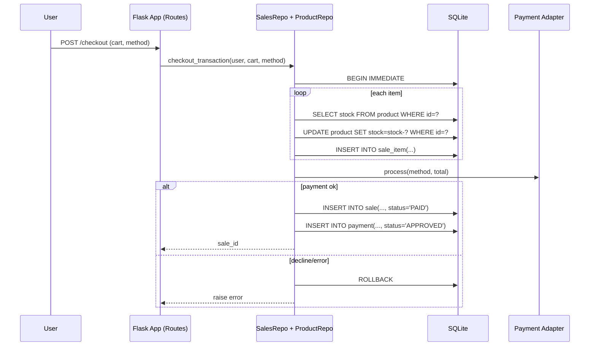

# Checkout Sequence

```mermaid
sequenceDiagram
  participant U as User
  participant A as Flask App (Routes)
  participant R as SalesRepo + ProductRepo
  participant DB as SQLite
  participant P as Payment Adapter

  U->>A: POST /checkout (cart, method)
  A->>R: checkout_transaction(user, cart, method)
  R->>DB: BEGIN IMMEDIATE
  loop each item
    R->>DB: SELECT stock FROM product WHERE id=?
    R->>DB: UPDATE product SET stock=stock-? WHERE id=?
    R->>DB: INSERT INTO sale_item(...)
  end
  R->>P: process(method, total)
  alt payment ok
    R->>DB: INSERT INTO sale(..., status='PAID')
    R->>DB: INSERT INTO payment(..., status='APPROVED')
    R-->>A: sale_id
  else decline/error
    R->>DB: ROLLBACK
    R-->>A: raise error
  end
```
