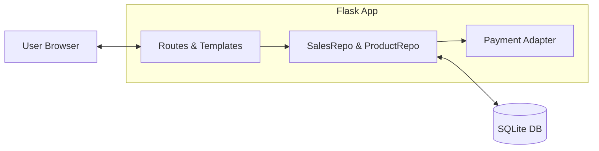

# System Overview (UML)

```mermaid
flowchart LR
  Browser[User Browser]
  subgraph FlaskApp[Flask App]
    UI[Routes & Templates]
    DAO[SalesRepo & ProductRepo]
    Payment[Payment Adapter]
  end
  DB[(SQLite DB)]

  Browser <--> UI
  UI --> DAO
  DAO <--> DB
  DAO --> Payment
```

Brief: User interacts via Flask routes/templates. Repos access SQLite and orchestrate checkout with a mock payment adapter.
