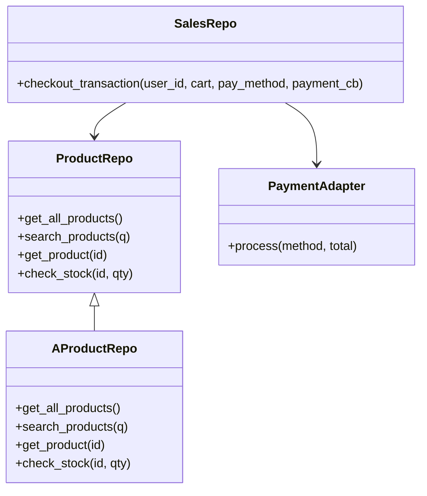
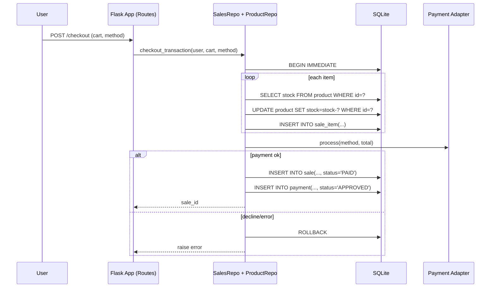
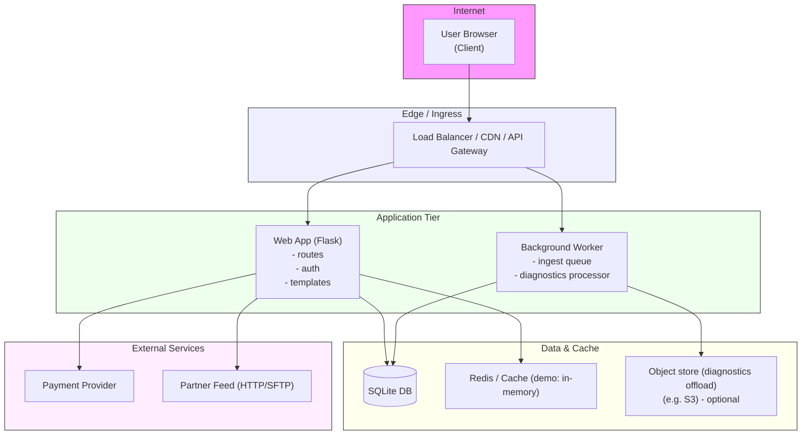
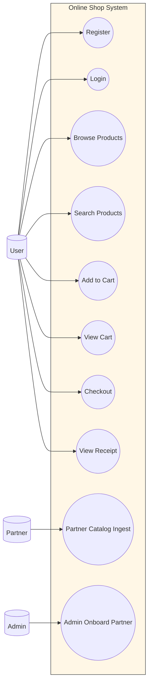

# UML Diagrams

## Logical View: Class Diagram



## Process View: System Sequence Diagram (Checkout)




## Deployment View


## Implementation View: Package / Module Diagram

```mermaid
flowchart TB
  subgraph App[Application Modules]
    routes["src/app.py / src/main.py\n- HTTP routes / blueprints"]
    dao["src/dao.py\n- SalesRepo, DB access"]
    product_repo["src/product_repo.py\n- ProductRepo"]
    payment["src/payment.py\n- Payment Adapters & resilience"]
    partners["src/partners/\n- routes, adapters, ingest queue"]
    flash["src/flash_sales/\n- manager, cache, rate-limiter"]
    worker["Background Worker\n- ingest_queue.process_next_job_once"]
  end

  routes --> dao
  routes --> product_repo
  routes --> payment
  routes --> partners
  routes --> flash
  partners --> worker
  worker --> dao
  worker --> payment
  partners --> product_repo
  payment --> "External: Payment Provider"
  dao --> "SQLite DB (persist)"
```


## Use-Case View



---