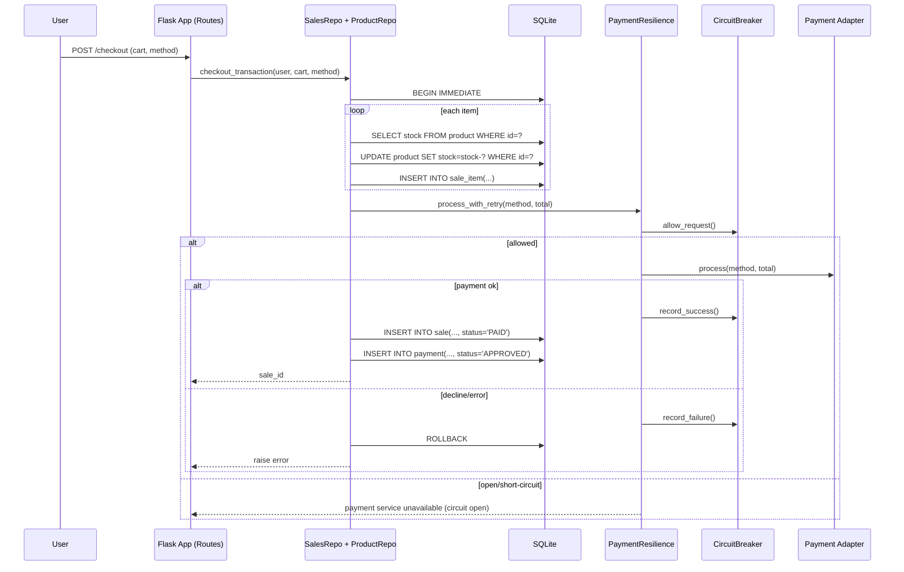
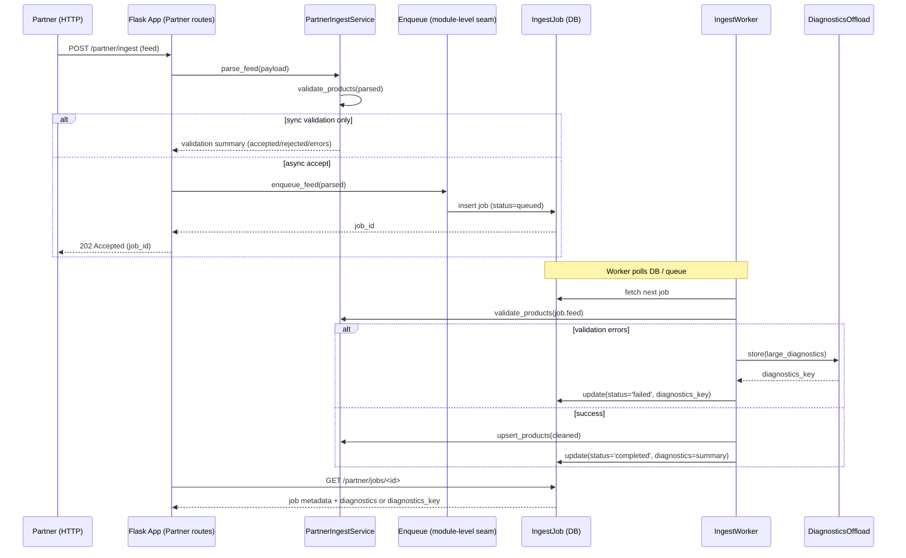
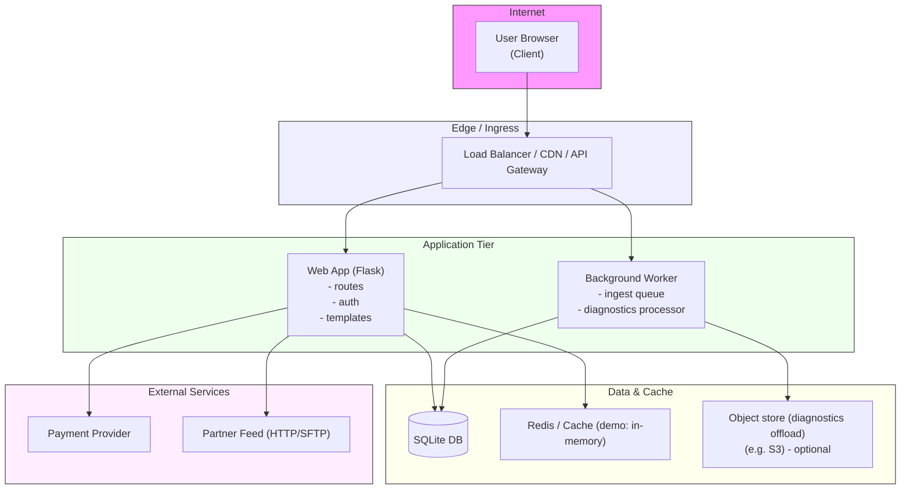
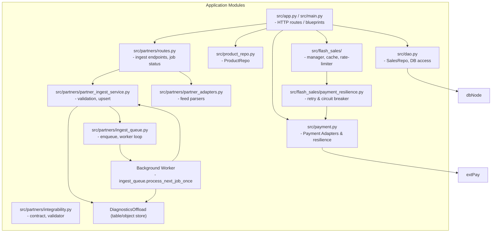
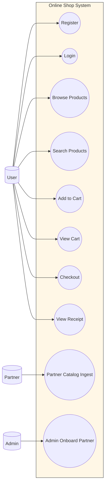

# UML Diagrams

## Logical View: Class Diagram

```mermaid
classDiagram
    %% ====== FLASH SALES MODULE (Your Work) ======
    
    %% Core Business Logic
    class FlashSaleManager {
        -conn: Connection
        +is_flash_sale_active(product_id: int) bool
        +get_effective_price(product_id: int) int
        +get_flash_products() List~Product~
        +log_event(product_id: int, event_type: str, details: str)
    }

    %% Performance Tactics
    class RateLimiter {
        -max_requests: int
        -window_seconds: int
        -requests: Dict
        -lock: Lock
        +is_allowed(identifier: str) bool
        +reset(identifier: str)
        +get_remaining(identifier: str) int
    }

    class SimpleCache {
        -default_ttl: int
        -cache: Dict
        -lock: Lock
        +get(key: str) Any
        +set(key: str, value: Any, ttl: int)
        +delete(key: str)
        +clear()
    }

    %% Availability Tactics
    class CircuitBreaker {
        -failure_threshold: int
        -timeout_seconds: int
        -state: CircuitState
        -failure_count: int
        +call(func: Callable) Any
        +record_success()
        +record_failure()
        +reset()
        +get_state() CircuitState
    }

    class CircuitState {
        <<enumeration>>
        CLOSED
        OPEN
        HALF_OPEN
    }

    class RetryDecorator {
        <<function>>
        +retry(max_attempts, delay_seconds, exceptions)
    }

    class PaymentResilience {
        -circuit_breaker: CircuitBreaker
        +process_payment_with_retry(method: str, amount_cents: int) Tuple
    }

    %% ====== PARTNER INTEGRATION MODULE (Vanessa's Work) ======
    
    class PartnerIngestService {
        -conn: Connection
        +validate_products(feed) ValidationResult
        +enqueue_feed(feed) JobId
    }

    class PartnerAdapter {
        +parse_feed(payload, content_type) List~Product~
    }

    class IngestQueue {
        +insert_job(status: str) JobId
        +fetch_next_job_once() Job
    }

    class IngestWorker {
        +process_next_job_once()
        +validate_products(job_feed)
        +store_diagnostics(diagnostics)
    }

    class DiagnosticsOffload {
        +store(blob: bytes) str
        +retrieve(key: str) bytes
    }

    class AuthMiddleware {
        +verify_api_key(key: str) bool
    }

    class InputValidator {
        +validate_feed(data) ValidationResult
        +sanitize_input(data) str
    }

    %% ====== SHARED MODULES ======
    
    class ProductRepo {
        -conn: Connection
        +get_all_products() List~Product~
        +search_products(query: str) List~Product~
        +get_product(id: int) Product
        +check_stock(id: int, qty: int) bool
    }

    class AProductRepo {
        -conn: Connection
        +get_all_products() List~Product~
        +get_product(id: int) Product
        +check_stock(id: int, qty: int) bool
    }

    class SalesRepo {
        -conn: Connection
        +checkout_transaction(user_id, cart, method, payment_cb)
        +create_sale(user_id, cart, payment_info)
    }

    class PaymentAdapter {
        +process(method: str, total: int) Tuple
    }

    %% ====== RELATIONSHIPS ======
    
    %% Flash Sales relationships
    FlashSaleManager --> ProductRepo : uses
    FlashSaleManager --> SimpleCache : caches results
    ProductRepo <|-- AProductRepo : inherits
    
    SalesRepo --> PaymentAdapter : uses
    SalesRepo --> RateLimiter : protected by
    
    PaymentResilience --> CircuitBreaker : uses
    PaymentResilience --> RetryDecorator : applies
    PaymentResilience --> PaymentAdapter : wraps
    CircuitBreaker --> CircuitState : has state
    
    %% Partner Integration relationships
    PartnerIngestService --> PartnerAdapter : uses
    PartnerIngestService --> IngestQueue : enqueues to
    PartnerIngestService --> AuthMiddleware : protected by
    PartnerIngestService --> InputValidator : validates with
    
    IngestWorker --> IngestQueue : polls from
    IngestWorker --> PartnerAdapter : uses
    IngestWorker --> DiagnosticsOffload : logs to
    IngestWorker --> ProductRepo : updates
    
    PartnerAdapter --> InputValidator : uses

    %% Notes
    note for FlashSaleManager "Flash Sales Module:\nManages time-based discounts"
    note for PartnerIngestService "Partner Integration Module:\nIngests external product feeds"
    note for RateLimiter "Shared Tactic:\nProtects both flash sales\nand partner endpoints"
    note for CircuitBreaker "Availability Pattern:\nPayment service protection"
```

## Process View: System Sequence Diagram (Checkout)

## Process View: Partner Ingest Sequence

## Deployment View

## Implementation View: Package / Module Diagram

## Use-Case View

---