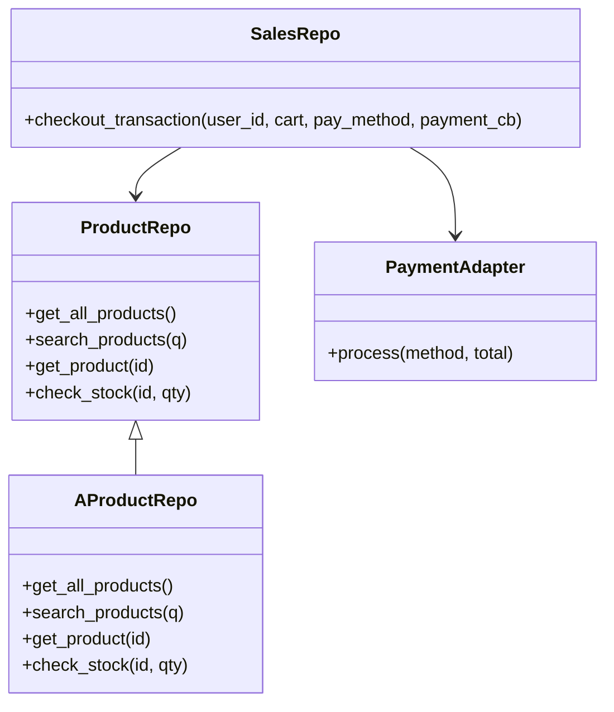
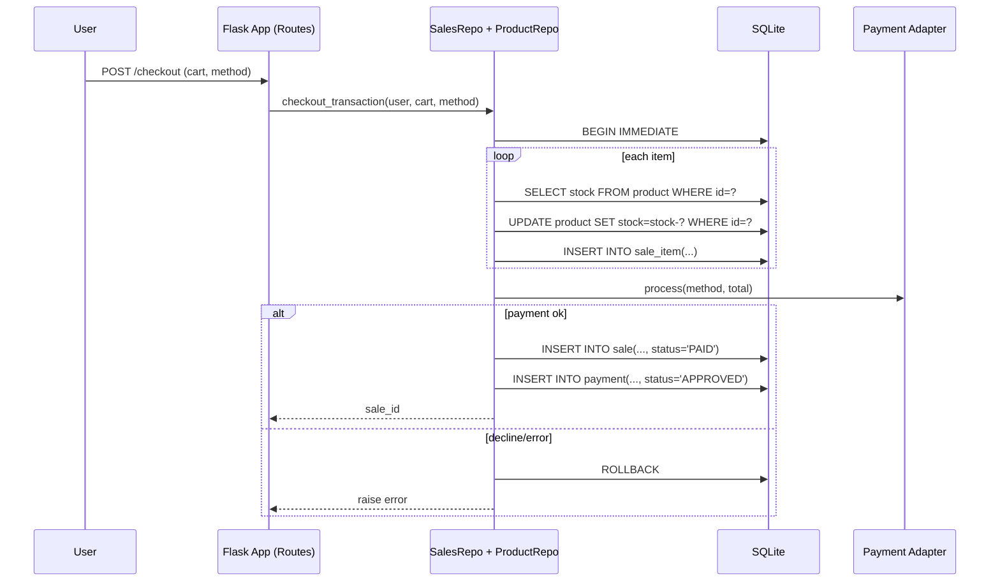
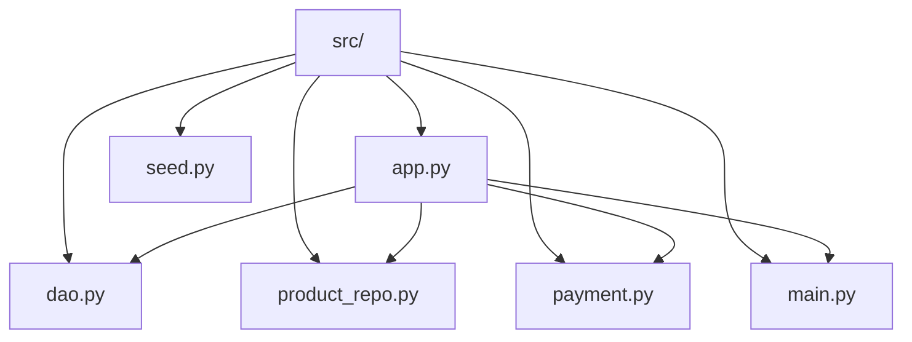

# UML Diagrams

## Logical View: Class Diagram



## Process View: System Sequence Diagram (Checkout)



## Deployment View

```mermaid
deploymentDiagram
  node Client {
    UserBrowser
  }
  node Server {
    FlaskApp
  }
  database SQLite
  UserBrowser --> FlaskApp
  FlaskApp --> SQLite
```

## Implementation View: Package/Module Diagram



## Use-Case View

```mermaid
usecaseDiagram
  actor User
  User --> (Register)
  User --> (Login)
  User --> (Browse Products)
  User --> (Search Products)
  User --> (Add to Cart)
  User --> (Checkout)
  User --> (View Receipt)
  User --> (View Cart)
  User --> (Remove from Cart)
  User --> (Clear Cart)
```

---

Each diagram above fulfills a specific UML view as required. You can copy these Mermaid diagrams into your documentation or render them using a Mermaid-compatible tool.
